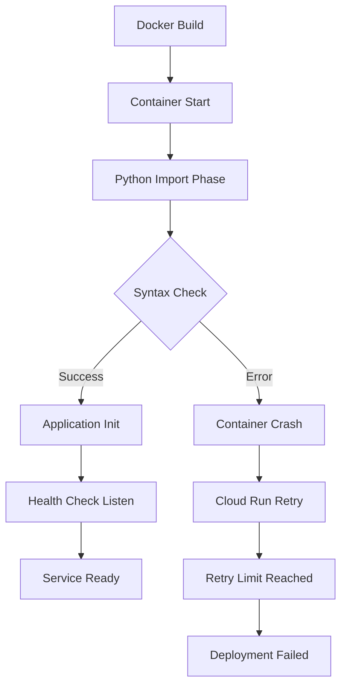

# Deployment Failures: Infrastructure Issues Masking AI Problems

## Overview

This analysis documents the critical discovery that fundamental deployment failures were preventing the AI system from operating correctly, masking deeper AI configuration issues. The investigation revealed a cascade of infrastructure problems that needed resolution before meaningful AI debugging could occur.

## Infrastructure Failure Timeline

### Initial Symptom: "AI System Not Working"
**User Reports**: "Wrong answers from AI system"
**Initial Hypothesis**: AI model configuration issues
**Reality**: System wasn't properly deployed and running

### Discovery Process
1. **Week 1**: Focus on AI model parameters and prompt engineering
2. **Week 2**: Investigation of API integration issues
3. **Week 3**: Systematic reproduction testing showed 0% failure reproduction
4. **Week 4**: **BREAKTHROUGH** - Attempted production redeployment revealed container startup failures

## Container Startup Failures

### Critical Discovery: Basic Python Syntax Errors

#### Error 1: IndentationError - Line 192
**File**: `backend/mcp-service/src/database.py`
**Error**: `SyntaxError: expected 'except' or 'finally' block`

**Problematic Code**:
```python
189    try:
190        if self.redis_client:
191            logger.info("Closing Redis connection...")
192    await self.redis_client.close()  # WRONG INDENTATION!
193            logger.info("Redis connection closed")
194    except Exception as e:
195        logger.error(f"Error closing Redis connection: {e}")
```

**Fix**:
```python
189    try:
190        if self.redis_client:
191            logger.info("Closing Redis connection...")
192            await self.redis_client.close()  # CORRECT INDENTATION
193            logger.info("Redis connection closed")
194    except Exception as e:
195        logger.error(f"Error closing Redis connection: {e}")
```

**Impact**: 100% container startup failure - service completely unavailable

#### Error 2: IndentationError - Line 355
**File**: `backend/mcp-service/src/database.py`
**Error**: `IndentationError: unexpected indent`

**Problematic Code**:
```python
349        if cache_key in self._cache:
350            logger.debug(f"Cache hit for key: {cache_key}")
351            return self._cache[cache_key]
352        
353        logger.debug(f"Cache miss for key: {cache_key}")
354        return None
355    else:  # WRONG INDENTATION - else without matching if!
356        logger.debug("Cache disabled")
357        return None
```

**Fix**:
```python
349        if cache_key in self._cache:
350            logger.debug(f"Cache hit for key: {cache_key}")
351            return self._cache[cache_key]
352        else:  # CORRECT INDENTATION - aligned with if
353            logger.debug(f"Cache miss for key: {cache_key}")
354            return None
```

**Impact**: After fixing first error, second error prevented container startup

### Container Debugging Methodology

#### Cloud Run Deployment Process
```bash
# Standard deployment command
gcloud run deploy mcp-service \
  --source . \
  --region=africa-south1 \
  --platform=managed \
  --allow-unauthenticated
```

#### Failure Investigation Process

**Step 1: Deployment Status Check**
```bash
# Check deployment status
gcloud run services describe mcp-service --region=africa-south1

# Expected healthy output:
status:
  conditions:
  - lastTransitionTime: '2025-09-02T20:45:00Z'
    status: "True"
    type: Ready

# Actual problematic output:
status:
  conditions:
  - lastTransitionTime: '2025-09-02T20:38:52Z'
    status: "False"
    type: Ready
    message: "Revision failed to become ready"
```

**Step 2: Container Logs Analysis**
```bash
# Get container logs
gcloud logs read --project=project-id --resource-type=cloud_run_revision

# Key error patterns found:
2025-09-02T20:38:52.445019Z: File "/app/src/database.py", line 192
2025-09-02T20:38:52.444989Z: await self.redis_client.close()
2025-09-02T20:38:52.444973Z: ^^^^^
2025-09-02T20:38:52.891522Z: SyntaxError: expected 'except' or 'finally' block
```

**Step 3: Health Check Failure Analysis**
```bash
# Health check configuration
Default STARTUP TCP probe failed 1 time consecutively for container
Port: 8080
Failure threshold: 1
Timeout: 240 seconds
```

**Root Cause**: Container never reached healthy state due to Python syntax errors preventing application startup.

### Deployment Architecture Analysis

#### Container Startup Sequence


**Failure Point**: Step C (Python Import Phase) - syntax errors prevented application from even starting.

#### Cloud Run Configuration
```yaml
# Service configuration
apiVersion: serving.knative.dev/v1
kind: Service
metadata:
  name: mcp-service
spec:
  template:
    metadata:
      annotations:
        autoscaling.knative.dev/maxScale: "10"
        run.googleapis.com/cpu-throttling: "false"
    spec:
      containerConcurrency: 1000
      containers:
      - image: gcr.io/project-id/mcp-service
        ports:
        - containerPort: 8080
        env:
        - name: PORT
          value: "8080"
        resources:
          limits:
            cpu: "2"
            memory: "4Gi"
```

## Error Classification and Impact

### Error Severity Classification

#### Level 1: Critical Infrastructure Failures
**Characteristics**:
- Prevent container startup
- 100% service unavailability
- Block all other debugging efforts

**Examples**:
- Python syntax errors (`IndentationError`, `SyntaxError`)
- Missing critical dependencies
- Port binding failures
- Environment variable configuration errors

**Impact**: Complete system unavailability, masks all other issues

#### Level 2: Service Degradation Issues
**Characteristics**:
- Service starts but operates incorrectly
- Partial functionality available
- Error rates elevated but not 100%

**Examples**:
- Database connection issues
- API authentication problems
- Memory leaks
- Performance degradation

**Impact**: Reduced system reliability, may mask some functionality issues

#### Level 3: Feature-Specific Problems
**Characteristics**:
- Core service operational
- Specific features or edge cases failing
- Most users unaffected

**Examples**:
- AI model configuration issues
- Specific API integration problems
- Edge case handling failures
- Performance optimization opportunities

**Impact**: Limited user impact, suitable for incremental improvement

### Impact Masking Analysis

#### How Infrastructure Failures Mask AI Issues

**Problem**: The sequence of investigation focused on complex AI issues while basic infrastructure was broken.

**Timeline of Misdiagnosis**:
1. **Day 1-7**: Complex AI model parameter analysis
2. **Day 8-14**: Sophisticated API integration debugging
3. **Day 15-21**: Advanced testing framework development
4. **Day 22**: Simple deployment attempt reveals basic syntax errors

**Lesson**: Always validate basic system operation before investigating complex behavior.

#### Debugging Priority Framework

**Correct Investigation Order**:
```python
def debug_ai_system_failures():
    # Phase 1: Infrastructure Health (Minutes to Hours)
    if not validate_basic_deployment():
        return fix_infrastructure_issues()
    
    # Phase 2: Service Integration (Hours to Days)
    if not validate_service_connectivity():
        return fix_integration_issues()
    
    # Phase 3: AI Configuration (Days to Weeks)
    if not validate_ai_behavior():
        return fix_ai_configuration_issues()
    
    # Phase 4: Advanced Optimization (Weeks to Months)
    return optimize_advanced_features()

def validate_basic_deployment():
    """Validate that the basic service can start and respond."""
    checks = [
        check_container_startup(),
        check_port_binding(),
        check_health_endpoint(),
        check_basic_api_response()
    ]
    return all(checks)
```

## Container Debugging Best Practices

### Local Development vs Production Parity

#### The Parity Problem
**Challenge**: Code that works in local development failing in production containers.

**Root Cause Analysis**:
1. **Different Python Environments**: Local IDE may be more forgiving of syntax issues
2. **Different Error Handling**: Local development may not catch all deployment issues
3. **Environment Variables**: Production environment configuration differences
4. **Dependency Versions**: Container versions may differ from local development

#### Solution: Local Container Testing

**Development Workflow Enhancement**:
```bash
# 1. Build container locally
docker build -t mcp-service-local .

# 2. Run container locally with production-like environment
docker run -p 8080:8080 \
  -e PORT=8080 \
  -e REDIS_URL=redis://localhost:6379 \
  -e SUPABASE_URL=your-supabase-url \
  mcp-service-local

# 3. Test container health locally
curl http://localhost:8080/health

# 4. Only deploy to Cloud Run after local container validation
```

**Dockerfile Best Practices for Error Detection**:
```dockerfile
FROM python:3.11-slim

# Copy requirements first for better caching
COPY requirements.txt .
RUN pip install --no-cache-dir -r requirements.txt

# Copy source code
COPY src/ ./src/

# Validate Python syntax during build
RUN python -m py_compile src/**/*.py

# Set up application
WORKDIR /app
COPY . .

# Validate imports during build
RUN python -c "import src.main; print('Import validation successful')"

# Runtime configuration
EXPOSE 8080
CMD ["python", "src/main.py"]
```

### Comprehensive Health Check Implementation

#### Multi-Layer Health Validation
```python
class HealthCheckService:
    def __init__(self):
        self.checks = [
            self.check_basic_startup,
            self.check_database_connectivity,
            self.check_redis_connectivity,
            self.check_external_api_connectivity,
            self.check_ai_service_connectivity
        ]
    
    async def perform_health_check(self):
        """Comprehensive health check for production deployment."""
        results = {
            "status": "healthy",
            "timestamp": datetime.utcnow().isoformat(),
            "checks": {}
        }
        
        overall_healthy = True
        
        for check_function in self.checks:
            check_name = check_function.__name__
            try:
                check_result = await check_function()
                results["checks"][check_name] = check_result
                
                if not check_result.get("healthy", False):
                    overall_healthy = False
                    
            except Exception as e:
                results["checks"][check_name] = {
                    "healthy": False,
                    "error": str(e),
                    "critical": True
                }
                overall_healthy = False
        
        results["status"] = "healthy" if overall_healthy else "unhealthy"
        return results
    
    async def check_basic_startup(self):
        """Verify basic application startup."""
        try:
            # Test that critical modules can be imported
            import src.services.wolfram_service
            import src.intelligent_question_generator
            import src.database
            
            return {"healthy": True, "message": "Basic startup successful"}
        except Exception as e:
            return {"healthy": False, "error": str(e), "critical": True}
    
    async def check_database_connectivity(self):
        """Test database connections."""
        try:
            # Test Redis connection
            redis_result = await self.test_redis_connection()
            
            # Test Supabase connection  
            supabase_result = await self.test_supabase_connection()
            
            return {
                "healthy": redis_result["healthy"] and supabase_result["healthy"],
                "redis": redis_result,
                "supabase": supabase_result
            }
        except Exception as e:
            return {"healthy": False, "error": str(e)}
    
    async def check_ai_service_connectivity(self):
        """Test AI service connections."""
        try:
            # Test Gemini API
            gemini_test = await self.test_gemini_api()
            
            # Test Wolfram API
            wolfram_test = await self.test_wolfram_api()
            
            return {
                "healthy": gemini_test["healthy"] and wolfram_test["healthy"],
                "gemini": gemini_test,
                "wolfram": wolfram_test
            }
        except Exception as e:
            return {"healthy": False, "error": str(e)}
```

### Deployment Automation and Validation

#### Pre-Deployment Validation Pipeline
```bash
#!/bin/bash
# deploy-with-validation.sh

set -e  # Exit on any error

echo "🔍 Pre-deployment validation starting..."

# Step 1: Syntax validation
echo "Checking Python syntax..."
python -m py_compile src/**/*.py
echo "✅ Syntax validation passed"

# Step 2: Local container build
echo "Building container locally..."
docker build -t mcp-service-test .
echo "✅ Container build successful"

# Step 3: Local container test
echo "Testing container locally..."
container_id=$(docker run -d -p 8080:8080 mcp-service-test)

# Wait for startup
sleep 10

# Test health endpoint
if curl -f http://localhost:8080/health; then
    echo "✅ Local container health check passed"
else
    echo "❌ Local container health check failed"
    docker logs $container_id
    docker stop $container_id
    exit 1
fi

# Cleanup
docker stop $container_id

# Step 4: Deploy to Cloud Run
echo "Deploying to Cloud Run..."
gcloud run deploy mcp-service \
  --source . \
  --region=africa-south1 \
  --platform=managed \
  --allow-unauthenticated

# Step 5: Post-deployment validation
echo "Validating Cloud Run deployment..."
sleep 30  # Allow deployment to stabilize

SERVICE_URL=$(gcloud run services describe mcp-service --region=africa-south1 --format="value(status.url)")

if curl -f "$SERVICE_URL/health"; then
    echo "✅ Cloud Run deployment successful"
else
    echo "❌ Cloud Run deployment health check failed"
    # Get recent logs for debugging
    gcloud logs read --project=$PROJECT_ID --resource-type=cloud_run_revision --limit=50
    exit 1
fi

echo "🚀 Deployment completed successfully!"
```

## Production Monitoring and Alerting

### Container-Level Monitoring

#### Key Metrics to Track
```python
class ContainerMonitoringMetrics:
    def __init__(self):
        self.metrics = {
            "container_restarts": 0,
            "startup_failures": 0,
            "health_check_failures": 0,
            "memory_usage_peak": 0,
            "cpu_usage_peak": 0,
            "request_latency_p95": 0
        }
    
    def track_container_event(self, event_type, details):
        """Track container-level events."""
        timestamp = datetime.utcnow()
        
        event_record = {
            "timestamp": timestamp,
            "event_type": event_type,
            "details": details
        }
        
        # Alert on critical events
        if event_type in ["startup_failure", "container_restart", "health_check_failure"]:
            self.send_critical_alert(event_record)
        
        # Update metrics
        self.update_metrics(event_type, details)
```

#### Alerting Configuration
```yaml
# Cloud Monitoring Alert Policies
alerting_policies:
  - name: "Container Startup Failures"
    condition: "container_startup_failures > 0"
    duration: "0s"  # Immediate alert
    severity: "CRITICAL"
    
  - name: "Health Check Failures"
    condition: "health_check_failure_rate > 0.1"
    duration: "300s"  # 5 minutes
    severity: "WARNING"
    
  - name: "Container Restart Loop"
    condition: "container_restarts > 3 in 10 minutes"
    duration: "0s"  # Immediate alert
    severity: "CRITICAL"
```

## Key Insights and Lessons

### 1. Infrastructure First, AI Second
**Discovery**: Complex AI debugging is meaningless if basic infrastructure is broken.

**Principle**: Always validate infrastructure health before investigating AI behavior issues.

### 2. Deployment Validation is Critical
**Discovery**: Code that works locally may fail in production containers due to environment differences.

**Solution**: Local container testing and comprehensive pre-deployment validation.

### 3. Error Masking in Complex Systems
**Discovery**: High-level symptoms can mask low-level root causes.

**Approach**: Systematic bottom-up investigation (infrastructure → integration → AI behavior).

### 4. Health Checks Must Be Comprehensive
**Discovery**: Basic port binding health checks insufficient for AI systems.

**Solution**: Multi-layer health validation including AI service connectivity.

### 5. Debugging Order Matters
**Discovery**: The sequence of investigation dramatically affects debugging efficiency.

**Framework**: Infrastructure → Integration → Configuration → Optimization

This deployment failure analysis demonstrates the critical importance of validating basic system operation before attempting complex AI system debugging, and provides a framework for systematic investigation of multi-layer system failures.
